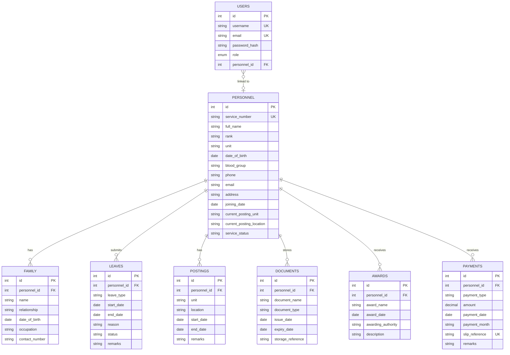

```mermaid
erDiagram
    USERS }o--o| PERSONNEL : "linked to"
    PERSONNEL ||--o{ FAMILY : has
    PERSONNEL ||--o{ LEAVES : submits
    PERSONNEL ||--o{ POSTINGS : has
    PERSONNEL ||--o{ DOCUMENTS : stores
    PERSONNEL ||--o{ AWARDS : receives
    PERSONNEL ||--o{ PAYMENTS : receives

    USERS {
      int id PK
      string username UK
      string email UK
      string password_hash
      enum role
      int personnel_id FK
    }
    PERSONNEL {
      int id PK
      string service_number UK
      string full_name
      string rank
      string unit
      date date_of_birth
      string blood_group
      string phone
      string email
      string address
      date joining_date
      string current_posting_unit
      string current_posting_location
      string service_status
    }
    FAMILY {
      int id PK
      int personnel_id FK
      string name
      string relationship
      date date_of_birth
      string occupation
      string contact_number
    }
    LEAVES {
      int id PK
      int personnel_id FK
      string leave_type
      date start_date
      date end_date
      string reason
      string status
      string remarks
    }
    POSTINGS {
      int id PK
      int personnel_id FK
      string unit
      string location
      date start_date
      date end_date
      string remarks
    }
    DOCUMENTS {
      int id PK
      int personnel_id FK
      string document_name
      string document_type
      date issue_date
      date expiry_date
      string storage_reference
    }
    AWARDS {
      int id PK
      int personnel_id FK
      string award_name
      date award_date
      string awarding_authority
      string description
    }
    PAYMENTS {
      int id PK
      int personnel_id FK
      string payment_type
      decimal amount
      date payment_date
      string payment_month
      string slip_reference UK
      string remarks
    }
```
